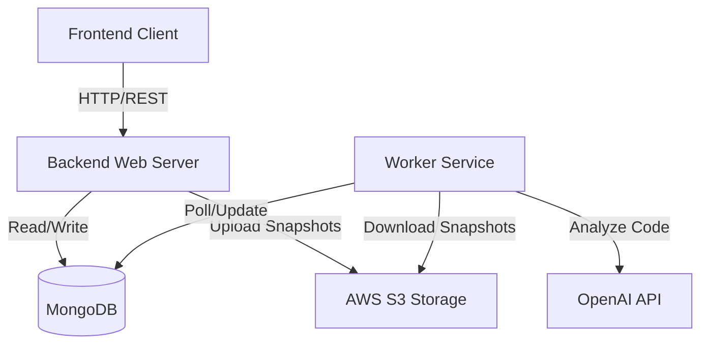

# AI Code Reviewer - System Design Document

## 1. Introduction

The **AI Code Reviewer** is a full-stack application designed to automate the code review process using Artificial Intelligence. It allows users to upload code repositories (via ZIP or GitHub), snapshot them for historical reference, and request detailed AI-driven analysis. The system identifies bugs, security vulnerabilities, code smells, and offers suggestions for improvement and architectural restructuring.

## 2. High-Level Architecture

The system follows a distributed architecture comprising a Client Application, a RESTful API Server, a Background Worker Service, and external cloud services for storage and AI processing.

### Architecture Diagram



### Core Components

1.  **Frontend (Client)**: A React-based Single Page Application (SPA) that provides the user interface for authentication, file uploads, and viewing review results.
2.  **Backend Web Server**: A Node.js/Express application that handles HTTP requests, authentication, file processing, and manages the database state.
3.  **Worker Service**: A separate Node.js process dedicated to CPU-intensive and long-running tasks. It polls for pending review requests and executes the code analysis pipeline.
4.  **Database (MongoDB)**: Stores user data, repository snapshots metadata, and review results.
5.  **Object Storage (AWS S3)**: Securely stores the actual code files (snapshots) associated with repositories.
6.  **AI Engine (OpenAI)**: External LLM service used to analyze code chunks and generate insights.

## 3. Detailed Component Design

### 3.1 Backend Web Server
*   **Framework**: Express.js
*   **Responsibilities**:
    *   **Authentication**: JWT-based auth (Login/Register).
    *   **Repository Management**: Handling ZIP uploads and GitHub repository cloning.
    *   **Snapshot Creation**: Unzipping, language detection, and uploading files to S3.
    *   **Review Management**: Creating review requests and serving results.
*   **Key Services**:
    *   `s3UploadFolder`: Recursively uploads directory structures to S3.
    *   `langDetect`: Analyzes file extensions to generate language statistics.
    *   `unZip`: Extracts uploaded archives.

### 3.2 Worker Service
*   **Type**: Background Job Processor (Polling-based)
*   **Responsibilities**:
    *   Monitors the database for `ReviewRequest` records with `status: 'pending'`.
    *   Downloads code snapshots from S3 to a temporary local workspace.
    *   Prepares code for analysis (filtering, chunking).
    *   Interacts with the LLM.
    *   Aggregates results and updates the database.
*   **Concurrency**: Uses atomic database operations (`findOneAndUpdate`) to ensure a job is processed by only one worker instance.

### 3.3 Database Schema (MongoDB)

#### Users Collection
Stores user credentials and profile info.
-   `email`: String (Unique)
-   `password`: String (Hashed)
-   `username`: String

#### RepoSnapshots Collection
Represents a specific state of a repository at a point in time.
-   `userId`: Reference to User
-   `repoName`: String
-   `s3Path`: String (S3 URI to the root of the snapshot)
-   `languageStats`: Object (e.g., `{ js: 50, css: 20 }`)
-   `createdAt`: Timestamp

#### ReviewRequests Collection
Tracks the lifecycle of a code review job.
-   `snapShotId`: Reference to RepoSnapshot
-   `requestBy`: Reference to User
-   `status`: Enum (`pending`, `processing`, `completed`, `failed`)
-   `result`: Object (The aggregated analysis output)
-   `startedAt`: Timestamp
-   `finishedAt`: Timestamp

## 4. Key Workflows

### 4.1 Repository Snapshot Flow (Upload)
1.  User uploads a ZIP file via the API.
2.  Server authenticates the request.
3.  Server saves ZIP to `tmp/uploads`.
4.  Server extracts ZIP to `tmp/extracted`.
5.  **Language Detection**: System scans files to calculate language usage stats.
6.  **S3 Upload**: Extracted files are uploaded to S3 under `snapshots/{userId}/{timestamp}/`.
7.  **Record Creation**: A `RepoSnapshot` document is created in MongoDB with the S3 path.
8.  **Cleanup**: Temporary local files are deleted.

### 4.2 Code Review Pipeline (The "Brain")
This process is executed by the Worker Service.

1.  **Job Acquisition**: Worker atomically finds and updates a pending `ReviewRequest` to `processing`.
2.  **Context Retrieval**: Worker resolves the S3 path from the associated Snapshot.
3.  **Download**: Files are downloaded from S3 to `tmp/worker/{reviewId}`.
4.  **File Selection (Heuristics)**:
    *   Filters out non-code files (images, binaries).
    *   Ignores build artifacts (`node_modules`, `dist`, `build`).
    *   Selects top 25 files based on relevance and size limits (max 50KB/file).
5.  **Chunking**:
    *   Large files are split into overlapping chunks (2000 chars + 200 overlap).
    *   Preserves context for the LLM.
6.  **LLM Analysis**:
    *   Each chunk is sent to the OpenAI API with a system prompt tailored for code review.
    *   Response format is strictly JSON containing `issues`, `suggestions`, and `summary`.
7.  **Aggregation**:
    *   Results from all chunks are merged.
    *   Duplicate issues are consolidated.
    *   Final summary is synthesized.
8.  **Completion**:
    *   Result is saved to the `ReviewRequest` document.
    *   Status updated to `completed`.
    *   Temporary worker files are cleaned up.

## 5. Directory Structure Strategy

The system utilizes a structured temporary directory approach to manage file I/O operations safely.

```
backend/
├── tmp/
│   ├── uploads/          # Raw ZIP uploads
│   ├── extracted/        # Unzipped content before S3 upload
│   └── worker/           # Workspace for active review jobs
```

*   **Cleanup Policy**: All temp directories are scoped by ID or Timestamp and are removed immediately after processing (in `finally` blocks) to prevent disk exhaustion.

## 6. Security Considerations

*   **Isolation**: User code is processed in isolated temporary directories.
*   **Secrets**: API Keys and Database URIs are managed via environment variables.
*   **Input Validation**: File uploads are restricted by type.
*   **Access Control**: All API endpoints (except Auth) require valid JWT tokens.
*   **S3 Security**: S3 buckets should be configured with private access policies; the backend acts as the secure gateway.

## 7. Scalability

*   **Horizontal Scaling**: The architecture decouples the Web Server from the Worker. You can scale the Web Server to handle more traffic and the Worker fleet to handle higher review throughput independently.
*   **Stateless Processing**: Workers are stateless; they fetch all necessary context from S3 and DB for every job.
*   **Asynchronous Design**: Long-running reviews do not block HTTP connections, ensuring a responsive UI.